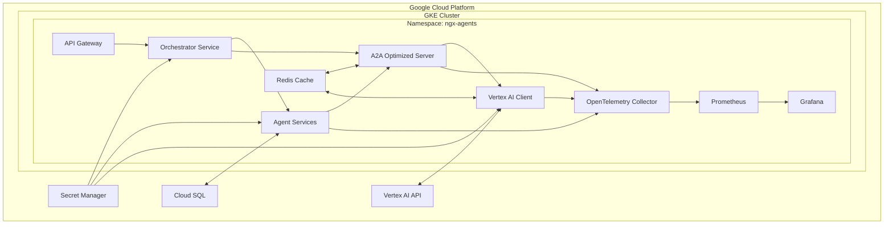

# Configuración del Entorno de Producción para NGX Agents

Este documento detalla la configuración recomendada para desplegar NGX Agents en un entorno de producción, incluyendo la configuración de Kubernetes, monitoreo, escalabilidad y seguridad.

## Arquitectura de Despliegue

La arquitectura de despliegue en producción se basa en Kubernetes para orquestar los contenedores y gestionar la escalabilidad y disponibilidad del sistema.



## Configuración de Kubernetes

### Recursos y Límites

Cada componente debe tener configurados recursos y límites adecuados para garantizar un rendimiento óptimo y evitar problemas de recursos.

#### Orchestrator Service

```yaml
resources:
  requests:
    cpu: 500m
    memory: 1Gi
  limits:
    cpu: 2000m
    memory: 2Gi
```

#### Agent Services

```yaml
resources:
  requests:
    cpu: 250m
    memory: 512Mi
  limits:
    cpu: 1000m
    memory: 1Gi
```

#### A2A Optimized Server

```yaml
resources:
  requests:
    cpu: 1000m
    memory: 2Gi
  limits:
    cpu: 4000m
    memory: 4Gi
```

#### Vertex AI Client

```yaml
resources:
  requests:
    cpu: 500m
    memory: 1Gi
  limits:
    cpu: 2000m
    memory: 2Gi
```

### Configuración de HPA (Horizontal Pod Autoscaler)

Para garantizar la escalabilidad automática basada en la carga:

```yaml
apiVersion: autoscaling/v2
kind: HorizontalPodAutoscaler
metadata:
  name: ngx-agents-hpa
  namespace: ngx-agents
spec:
  scaleTargetRef:
    apiVersion: apps/v1
    kind: Deployment
    name: ngx-agents-deployment
  minReplicas: 3
  maxReplicas: 10
  metrics:
  - type: Resource
    resource:
      name: cpu
      target:
        type: Utilization
        averageUtilization: 70
  - type: Resource
    resource:
      name: memory
      target:
        type: Utilization
        averageUtilization: 80
```

### Afinidad y Anti-afinidad

Para garantizar la alta disponibilidad y distribución adecuada de pods:

```yaml
affinity:
  podAntiAffinity:
    preferredDuringSchedulingIgnoredDuringExecution:
    - weight: 100
      podAffinityTerm:
        labelSelector:
          matchExpressions:
          - key: app
            operator: In
            values:
            - ngx-agents
        topologyKey: "kubernetes.io/hostname"
```

## Configuración de Redis

Redis se utiliza para caché distribuido y gestión de estado. Configuración recomendada:

```yaml
apiVersion: v1
kind: ConfigMap
metadata:
  name: redis-config
  namespace: ngx-agents
data:
  redis.conf: |
    maxmemory 2gb
    maxmemory-policy allkeys-lru
    appendonly yes
    save 900 1
    save 300 10
    save 60 10000
    tcp-keepalive 60
    timeout 300
    notify-keyspace-events KEA
```

### Persistencia de Redis

```yaml
apiVersion: v1
kind: PersistentVolumeClaim
metadata:
  name: redis-data
  namespace: ngx-agents
spec:
  accessModes:
    - ReadWriteOnce
  resources:
    requests:
      storage: 10Gi
  storageClassName: standard
```

## Monitoreo y Observabilidad

### Prometheus

Configuración para recopilar métricas de todos los componentes:

```yaml
apiVersion: monitoring.coreos.com/v1
kind: ServiceMonitor
metadata:
  name: ngx-agents-monitor
  namespace: ngx-agents
spec:
  selector:
    matchLabels:
      app: ngx-agents
  endpoints:
  - port: metrics
    interval: 15s
    path: /metrics
```

### Grafana

Dashboards recomendados:

1. **NGX Agents Overview**: Métricas generales del sistema
2. **A2A Communication**: Latencia y throughput de comunicación entre agentes
3. **Vertex AI Client**: Uso de API, latencia y costos
4. **Agent Performance**: Métricas específicas por agente
5. **System Resources**: Uso de CPU, memoria y red

### Alertas

Configuración de alertas críticas:

```yaml
apiVersion: monitoring.coreos.com/v1
kind: PrometheusRule
metadata:
  name: ngx-agents-alerts
  namespace: ngx-agents
spec:
  groups:
  - name: ngx-agents
    rules:
    - alert: HighErrorRate
      expr: sum(rate(http_requests_total{status=~"5.."}[5m])) / sum(rate(http_requests_total[5m])) > 0.05
      for: 5m
      labels:
        severity: critical
      annotations:
        summary: "High error rate detected"
        description: "Error rate is above 5% for the last 5 minutes"
    
    - alert: HighLatency
      expr: histogram_quantile(0.95, sum(rate(http_request_duration_seconds_bucket[5m])) by (le)) > 2
      for: 5m
      labels:
        severity: warning
      annotations:
        summary: "High latency detected"
        description: "95th percentile latency is above 2 seconds for the last 5 minutes"
    
    - alert: HighMemoryUsage
      expr: (sum(container_memory_usage_bytes{namespace="ngx-agents"}) / sum(kube_pod_container_resource_limits_memory_bytes{namespace="ngx-agents"})) > 0.85
      for: 15m
      labels:
        severity: warning
      annotations:
        summary: "High memory usage"
        description: "Memory usage is above 85% of the limit for the last 15 minutes"
```

## Seguridad

### Network Policies

Restricción de tráfico entre componentes:

```yaml
apiVersion: networking.k8s.io/v1
kind: NetworkPolicy
metadata:
  name: ngx-agents-network-policy
  namespace: ngx-agents
spec:
  podSelector:
    matchLabels:
      app: ngx-agents
  policyTypes:
  - Ingress
  - Egress
  ingress:
  - from:
    - podSelector:
        matchLabels:
          app: ngx-agents
    ports:
    - protocol: TCP
      port: 8080
  egress:
  - to:
    - podSelector:
        matchLabels:
          app: ngx-agents
    ports:
    - protocol: TCP
      port: 8080
  - to:
    - ipBlock:
        cidr: 0.0.0.0/0
        except:
        - 10.0.0.0/8
        - 172.16.0.0/12
        - 192.168.0.0/16
    ports:
    - protocol: TCP
      port: 443
```

### Gestión de Secretos

Utilizar Secret Manager de Google Cloud para gestionar credenciales:

```yaml
apiVersion: v1
kind: Secret
metadata:
  name: vertex-ai-credentials
  namespace: ngx-agents
type: Opaque
stringData:
  credentials.json: ${VERTEX_AI_CREDENTIALS}
```

## Variables de Entorno

Variables de entorno críticas para el entorno de producción:

```
# General
ENVIRONMENT=production
LOG_LEVEL=info

# A2A Server
A2A_SERVER_HOST=a2a-server
A2A_SERVER_PORT=8080
A2A_MAX_RETRIES=3
A2A_RETRY_DELAY=1000
A2A_CIRCUIT_BREAKER_THRESHOLD=5
A2A_CIRCUIT_BREAKER_TIMEOUT=30000

# Vertex AI
VERTEX_AI_PROJECT_ID=${PROJECT_ID}
VERTEX_AI_LOCATION=us-central1
VERTEX_AI_MODEL_ID=text-bison
VERTEX_AI_CACHE_TTL=3600
VERTEX_AI_POOL_SIZE=10
VERTEX_AI_MAX_TOKENS=1024

# Redis
REDIS_HOST=redis
REDIS_PORT=6379
REDIS_PASSWORD=${REDIS_PASSWORD}
REDIS_DB=0
REDIS_CACHE_TTL=3600

# Telemetry
OTEL_EXPORTER_OTLP_ENDPOINT=http://otel-collector:4317
OTEL_SERVICE_NAME=ngx-agents
OTEL_RESOURCE_ATTRIBUTES=service.namespace=ngx,service.version=1.0.0

# Database
DB_HOST=${DB_HOST}
DB_PORT=5432
DB_NAME=ngx_agents
DB_USER=${DB_USER}
DB_PASSWORD=${DB_PASSWORD}
DB_SSL_MODE=require
```

## Estrategia de Despliegue

### Despliegue Gradual (Canary)

Implementar un despliegue canary para minimizar riesgos:

1. Desplegar la nueva versión al 20% del tráfico
2. Monitorear métricas clave durante 30 minutos
3. Si no hay problemas, aumentar al 50% del tráfico
4. Monitorear durante 1 hora
5. Si no hay problemas, completar el despliegue al 100%

### Rollback

Procedimiento de rollback en caso de problemas:

```bash
# Revertir a la versión anterior
kubectl rollout undo deployment/ngx-agents-deployment -n ngx-agents

# Verificar el estado del rollback
kubectl rollout status deployment/ngx-agents-deployment -n ngx-agents
```

## Backup y Recuperación

### Backup Automático

Configurar backups automáticos de la base de datos y estado del sistema:

```yaml
apiVersion: batch/v1
kind: CronJob
metadata:
  name: ngx-agents-backup
  namespace: ngx-agents
spec:
  schedule: "0 2 * * *"  # Diariamente a las 2 AM
  jobTemplate:
    spec:
      template:
        spec:
          containers:
          - name: backup
            image: gcr.io/cloud-builders/gcloud
            command:
            - /bin/sh
            - -c
            - |
              gcloud sql export sql ${DB_INSTANCE} gs://${BACKUP_BUCKET}/ngx-agents-$(date +%Y%m%d).sql --database=ngx_agents
          restartPolicy: OnFailure
```

### Plan de Recuperación ante Desastres

1. **RTO (Recovery Time Objective)**: 1 hora
2. **RPO (Recovery Point Objective)**: 24 horas
3. **Procedimiento**:
   - Restaurar la base de datos desde el último backup
   - Desplegar la infraestructura utilizando Terraform
   - Aplicar las configuraciones de Kubernetes
   - Verificar la integridad del sistema

## Optimización de Costos

### Recomendaciones

1. **Autoscaling**: Configurar correctamente el autoscaling para escalar a cero en entornos no productivos
2. **Spot Instances**: Utilizar instancias spot para componentes no críticos
3. **Caché**: Optimizar la estrategia de caché para reducir llamadas a Vertex AI
4. **Monitoreo de Costos**: Implementar etiquetas para seguimiento de costos por componente

```yaml
apiVersion: v1
kind: Pod
metadata:
  name: ngx-agents-pod
  labels:
    app: ngx-agents
    cost-center: ai-services
    environment: production
```

## Próximos Pasos

1. Implementar la configuración de Kubernetes
2. Configurar el monitoreo y alertas
3. Realizar pruebas de carga en un entorno de staging
4. Implementar la estrategia de despliegue gradual
5. Configurar backups automáticos
