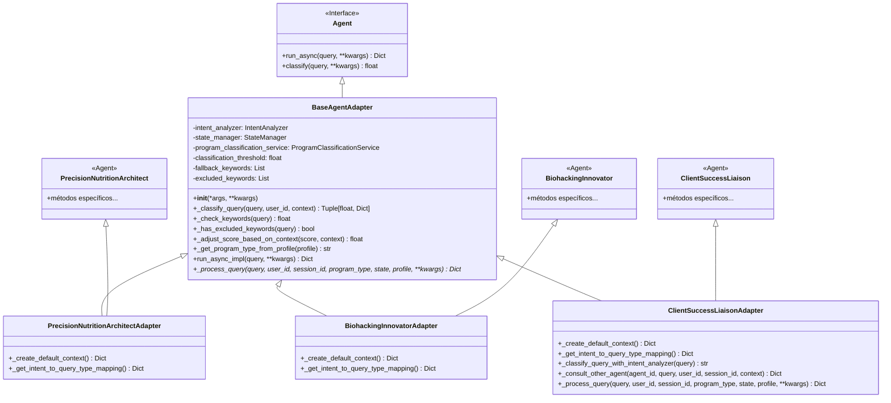

# Diagrama de Clases de Adaptadores

Este diagrama muestra la estructura de clases de los adaptadores en el proyecto NGX Agents, destacando la relación entre la clase base `BaseAgentAdapter` y los adaptadores específicos.

## Diagrama de Clases

## Descripción

### Clase Base: BaseAgentAdapter

La clase `BaseAgentAdapter` implementa la interfaz `Agent` y proporciona funcionalidad común para todos los adaptadores:

- **Clasificación de consultas**: Implementa un método `_classify_query` que utiliza una combinación de análisis de intención y palabras clave.
- **Manejo de errores**: Proporciona manejo de errores consistente en todos los adaptadores.
- **Telemetría**: Integra telemetría para monitoreo y diagnóstico.
- **Determinación de tipo de programa**: Implementa `_get_program_type_from_profile` para determinar el tipo de programa basado en el perfil del usuario.

### Adaptadores Específicos

Cada adaptador específico hereda tanto de su agente original como de `BaseAgentAdapter`:

1. **PrecisionNutritionArchitectAdapter**:
   - Especializado en planificación nutricional y análisis de biomarcadores.
   - Implementa `_create_default_context` y `_get_intent_to_query_type_mapping` específicos.

2. **BiohackingInnovatorAdapter**:
   - Especializado en optimización hormonal y mejora cognitiva.
   - Implementa `_create_default_context` y `_get_intent_to_query_type_mapping` específicos.

3. **ClientSuccessLiaisonAdapter**:
   - Especializado en soporte al cliente y gestión de la experiencia del usuario.
   - Implementa métodos adicionales como `_classify_query_with_intent_analyzer` y `_consult_other_agent`.

## Flujo de Ejecución

1. El usuario envía una consulta.
2. El adaptador clasifica la consulta usando `_classify_query`.
3. Si la puntuación de clasificación supera el umbral, el adaptador procesa la consulta usando `_process_query`.
4. El resultado se devuelve al usuario y se actualiza el estado si es necesario.

## Ventajas de esta Arquitectura

- **Reducción de código duplicado**: La lógica común se implementa una sola vez en la clase base.
- **Consistencia**: Todos los adaptadores manejan errores y telemetría de manera uniforme.
- **Mantenibilidad**: Los cambios en la lógica común solo necesitan hacerse en un lugar.
- **Extensibilidad**: Nuevos adaptadores pueden crearse fácilmente heredando de `BaseAgentAdapter`.
